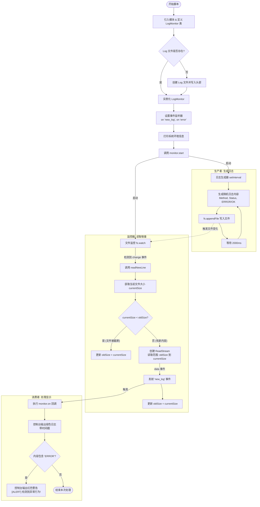

# Hyper Log JS

一个基于 Node.js 的轻量级实时日志监控与告警示例。通过“生产者-监控器-消费者”的事件流，增量读取 `access.log` 中的新内容，彩色打印并在检测到错误关键字时提示告警。

## 快速开始

- 运行环境：建议 Node.js 16+（更高版本亦可）
- 启动命令：

```powershell
node realtime_logger.js
```

启动后：
- 每 2 秒生成一条随机 HTTP 日志（方法：GET/POST/DELETE；状态码：200/201/404/500）。
- 监控器增量读取 `access.log` 的新增内容，并通过事件分发到消费者处理。
- 控制台彩色打印日志；遇到包含 `ERROR` 的行时输出红色告警。

## 项目结构

```
.
├─ realtime_logger.js      # 主脚本：生产者 + 监控器 + 消费者
├─ access.log              # 运行时日志文件（脚本会生成/追加）
├─ package.json            # 项目信息（若存在）
```

## 工作原理（流程图）



## 关键实现要点

- 增量读取：通过记录上次读取位置（`filesize`），仅读取新追加的内容。
- 事件流：`readStream.on('data')` 触发 `emit('new_log', ...)`，消费者通过 `monitor.on('new_log', ...)` 处理。
- 彩色输出：使用 ANSI 转义（`\x1b[32m` 绿色、`\x1b[31m` 红色）增强可读性。
- 基础告警：当日志行包含 `ERROR` 时输出警告。

## 已知问题（待改进）

- `os.type` 与 `os.arch` 在代码中未调用为函数，当前输出的可能不是预期字符串，建议改为 `os.type()`、`os.arch()`。
- `fs.watch` 在某些平台/场景下对文件追加事件不稳定，建议评估：
  - 替换为 `fs.watchFile`（基于轮询），或
  - 引入更可靠的库如 `chokidar`（跨平台文件监控）。
- `fs.createReadStream` 的 `end` 参数为“包含性”（inclusive），从 `oldSize` 到 `currentSize` 可能出现边界字符重复；可考虑改为 `end: currentSize - 1` 或在消费者层做去重处理。
- 时间戳仅包含日期（`toLocaleDateString`），不含时间；若需更精确的审计时间，建议改用 `toLocaleString()` 或引入 `dayjs`/`date-fns`。
- 日志持续增长，缺少滚动/归档策略；建议当 `access.log` 超过阈值（如 10MB）时进行归档并重置。
- `.gitignore` 未统一管理（建议忽略 `node_modules/` 与 `access.log`）。

## TODO List

- 修复系统信息输出：改为 `os.type()`、`os.arch()`。
- 优化时间戳显示：改为 `toLocaleString()` 或引入时间库。
- 提升文件监控可靠性：评估并替换为 `chokidar` 或 `fs.watchFile`。
- 增加日志滚动策略：超过阈值自动归档 `access.log.*`。
- 添加 `.gitignore`：忽略 `node_modules/` 与 `access.log`。
- 提供可配置项：日志间隔、方法/状态分布、ERROR 关键字等。
- 增加告警通道：支持系统通知/邮件/IM 机器人（钉钉/飞书）。
- 编写基础测试：针对增量读取与事件分发的单元测试。

